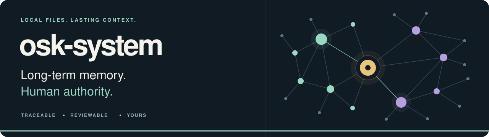
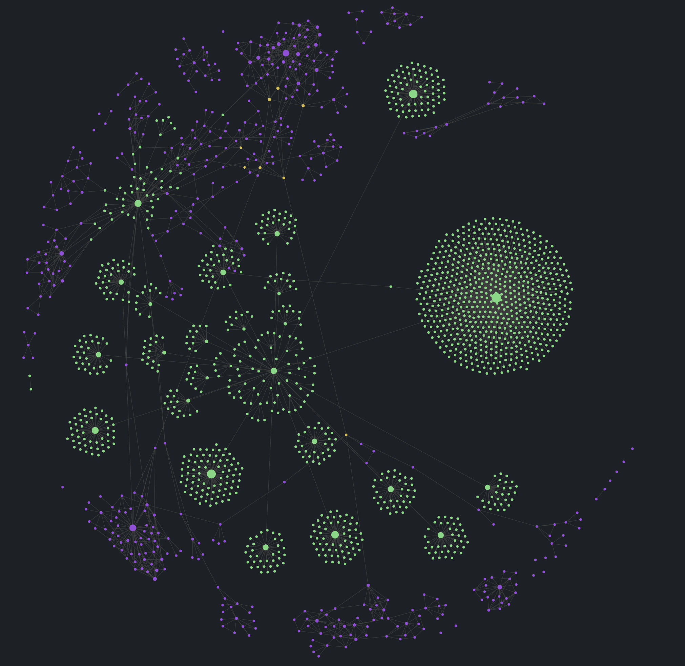
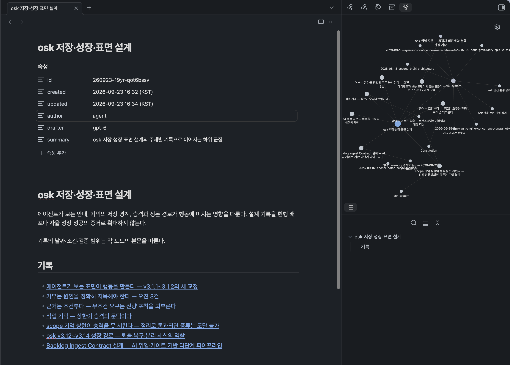

<p align="center">
  <strong>English</strong> · <a href="README.ko.md">한국어</a>
</p>

<p align="center">
  
</p>

<p align="center">
  <strong>Give your agents a memory you can actually inspect.</strong><br>
  A local Markdown knowledge graph with traceable evidence and human-controlled approval.
</p>

<p align="center">
  <a href="https://www.python.org/"></a>
  <a href="https://modelcontextprotocol.io/"></a>
  <a href="https://daringfireball.net/projects/markdown/"></a>
  <a href="https://obsidian.md/"></a>
  <a href="https://git-scm.com/"></a>
</p>

<p align="center">
  <a href="https://github.com/lpaiu-cs/osk-system/releases"></a>
  <a href="LICENSE"></a>
  
</p>

<p align="center">
  <a href="#quick-start">Quick start</a> ·
  <a href="docs/GETTING-STARTED.md">Getting started</a> ·
  <a href="#usage">Usage</a> ·
  <a href="docs/SETUP.md">Setup guide</a> ·
  <a href="#governance">Design &amp; governance</a>
</p>

---

> **Status: developer public beta.** The maintainer uses it daily on Windows 11,
> and CI runs the test suite on Windows and Linux. macOS is not yet verified.
> Your vault is a Git repository: keep it pushed to your own private remote, or
> otherwise backed up, before every update. See the
> [known limitations](#known-limitations).

## Keep the context. Keep the evidence.

Agent memory needs more than storage. It needs a reliable distinction between
**what a person has approved and what an agent has only proposed**.
osk-system keeps knowledge in local files, connects it to its sources, and
records approval separately from the notes an agent can edit.

<p align="center">
  <a href="docs/assets/readme/obsidian-graph.png"></a>
  <br>
  <sub>A real, populated vault in Obsidian. Fresh instances start with empty knowledge Spaces. Click to view full size.</sub>
</p>

| What you need | How osk-system helps |
|---|---|
| Context across conversations | Project-scoped memory and MCP search and reading tools |
| Recall you can trace | References from knowledge nodes to source nodes and specific conversation rounds |
| Changes a person can review | Protected-region snapshots and explicit changesets |
| Knowledge you can read and keep | Markdown files, an Obsidian graph, and optional Git synchronization |

## The stack

A Python engine exposes MCP tools over stdio, stores knowledge in Markdown,
and retrieves it with BM25. Obsidian is an optional way to explore the graph;
Git synchronization is opt-in. Capture and periodic-review adapters currently
support **Codex and Claude Code**. See the
[runtime dependencies](_governance/_engine/requirements.txt).

## Quick start

**New to osk-system?** Follow the [Getting started](docs/GETTING-STARTED.md)
tutorial. It goes from an empty folder to your agent's first saved memory, on
macOS, Linux and Windows, with a check after every step.

You need Python 3.11 or newer (the commands use 3.12; change the version to
match yours) and Git. Start from a release tag rather than `main`
(newer tags are on the [releases page](https://github.com/lpaiu-cs/osk-system/releases)).
On macOS or Linux:

```bash
git clone --branch v3.22.2 https://github.com/lpaiu-cs/osk-system.git my-osk-vault
cd my-osk-vault
git switch -c main
python3.12 -m venv .venv
.venv/bin/python -m pip install -r _governance/_engine/requirements.txt
PYTHONPATH=_governance/_engine .venv/bin/python -m osk.cli --help
```

Then record the release baseline
([Getting started, Step 2](docs/GETTING-STARTED.md#step-2-install-the-engine-and-record-the-release-baseline)),
so that later updates can tell release files from your own edits.

1. Register the MCP server, replacing `<REPO>` with your instance's absolute
   path. JSON-configured clients can copy [.mcp.json.example](.mcp.json.example);
   Codex reads TOML, so register it with `codex mcp add`. Follow the
   [setup guide](docs/SETUP.md) for client-specific registration, hooks, and
   Windows commands. The detailed operations and governance documents are
   currently in Korean.
2. If you use Obsidian, open `my-osk-vault` as a vault.
3. Before enabling synchronization, point your instance at **your own private
   remote**. Do not push personal notes, ledgers, or transcripts to the public
   upstream repository.

> Connecting MCP does not enable automatic capture or periodic review by itself.
> Configure the hooks for your harness. See [harness coverage](#harness-coverage).

## Usage

<p align="center">
  <a href="docs/assets/readme/obsidian-note-local-graph.png"></a>
  <br>
  <sub>Read a knowledge note alongside its local graph. Original capture from a Korean-language vault; click to view full size.</sub>
</p>

**Recall → inspect the evidence → update reviewed knowledge.** With MCP connected,
you can ask your agent:

```text
Find prior decisions about this project. Read the source notes before drawing conclusions.

Record the verified outcome of this task in the project's Scope,
link its evidence, and show me what still needs my review.
```

In Obsidian, explore connections between clusters in the global graph, then open
a note beside its local graph to read the surrounding context. **The graph shows
connections, not approval status.** Use the engine's `status` command to check
protected regions; review their changesets in the human approval workflow.

```bash
PYTHONPATH=_governance/_engine .venv/bin/python -m osk.cli status
PYTHONPATH=_governance/_engine .venv/bin/python -m osk.cli search "project decisions"
```

## Why the distinction matters

In an agent-written knowledge base, one boundary keeps getting blurred:
**what the user has confirmed versus what an agent has merely produced**.
Once that distinction is lost, a memory becomes a collection of plausible
claims, and recall becomes unreliable.

osk-system makes this distinction mechanically checkable instead of leaving it
to convention. Three design choices support it:

- **Authority lives outside the node.** Approval is a record in a separate
  ledger, not a field an agent can edit. The engine preserves the last
  user-approved snapshot of an entire protected region. Edits become a
  changeset awaiting approval or rejection. Protecting, unprotecting,
  approving, and reverting are user-only operations.
- **Causality, not timestamps, determines the result.** Ledger records reference
  their parents to form a causal DAG. The engine uses causal maxima, not
  last-write-wins. If a multi-device merge leaves incomparable heads, the
  result remains unresolved until a new user record joins all branches.
- **MCP writes pass through contract validation.** The surface is not read-only:
  validated node writes are available, while protected-region authority and
  pin controls are not exposed. Direct filesystem writes do not pass through
  these checks.

The principle is simple: **do not claim to enforce what you cannot enforce.**
Authorization remains unresolved unless the engine can evaluate its applicability.
Protected regions help prevent and recover from honest mistakes; they are **not a
security boundary against someone with arbitrary write access to the vault**.
See the [engine's limitations](_governance/_engine/README.md#알려진-한계).

## Harness coverage

Automatic capture, periodic integration, and subscription-backed forks currently
have adapters for **Codex and Claude Code**. Being able to call MCP tools from
another client does not mean session hooks or autonomous knowledge growth are
connected.

| Runtime conditions | Conversation review path |
|---|---|
| Supported hooks and subscription CLI; authentication and version checks pass | A background fork using the same harness and model after every **9 successful final-answer Stop events** |
| CLI unavailable or unconfigured; login, subscription, version, or permission checks fail; Codex task directory is neither a Git worktree nor a trusted Codex project | A **review warning** and in-session integration at **UserPromptSubmit turns 9 and 15** |
| Harness without an adapter | No guarantee of automatic capture, counting, or fallback; integration and verification are still required |

Input counts continue in background mode. Switching paths does not reset pending
reviews or either counter; a pending review already past turn 9 is surfaced
immediately. When login recovers, review returns to Stop-based execution.
Failed subscription checks do not silently fall back to paid API calls.

<details>
<summary>Cache evidence, review boundaries, and future harness support</summary>

Cache reuse is a separate verification target. A fork immediately after a final
answer in the Codex app, using the same Sol model, achieved a **98.74% cache hit
rate** in one measured experiment. The default CLI configuration on the same
source session achieved 0%, so app-originated forks preserve app tool definitions
automatically. This is not a universal guarantee across versions or models.
Implementation, installation, cache hits, and actual node growth are different
claims. See [setup and fallback behavior](docs/SETUP.md) and
[experimental evidence and limitations](docs/response-growth.md).

Updates belong together when they concern the same **claim and applicability
conditions**, not simply the next task in a project. Organization review records
the ranges actually read; reading only part of a cluster does not complete the
whole cluster's review. See [bounded review and safe splitting](docs/hub-growth-review.md).

Each additional harness needs verification of conversation and completion IDs,
transcript boundaries, hook events, subscription authentication, one-shot
execution, and failure fallbacks.

</details>

## Known limitations

- **Folders outside Git share by name.** The session key is the repository
  folder's name (worktrees fold into their main repository; submodules and bare
  repositories use their own name). Since v4 an unrelated Git repository whose
  root commits differ from the key's owner gets `<name>-<first 8 hex of its root>`
  instead, so it neither receives nor writes the other's Scope memory. Folders
  outside Git, repositories without commits and shallow clones have no identity
  and still share by folder name.
- **Background reviews inherit the source session's permissions.** A
  subscription fork review runs unattended with the reviewed session's own
  Claude Code permission mode, or Codex approval and sandbox policy. This is by
  design. The fork re-reads that conversation, including any untrusted text it
  contains.
- **Node bodies are not secret-filtered.** This is by design. The secret filter
  covers raw transcripts, Scope memory, and writes distilled from raw records.
  Keep secrets out of notes: they are committed and synchronized.
- **Protected regions are not a security boundary.** They help prevent and
  recover from honest mistakes; see [Why the distinction matters](#why-the-distinction-matters).
- **Autonomous growth is experimental.** Its effect is still being measured
  ([issue #20](https://github.com/lpaiu-cs/osk-system/issues/20)).
- **The governing documents are in Korean only.**

## Governance

The rules defining the system live in `_governance/`, outside the knowledge
Spaces: the rules that organize knowledge are not themselves knowledge being
organized by the system.

| Document | Responsibility |
|---|---|
| [Constitution](_governance/Constitution.md) | Spaces, nodes, reference topology, delegation, protected regions, cases, and amendments |
| [Bylaws](_governance/Bylaws.md) | Operating rules for node and raw-record contracts, clusters, pins, delegation, and protected regions |
| [Mechanism](_governance/Mechanism.md) | Physical layout, identifiers, timestamps, ledgers, MCP contracts, link syntax, and secret filtering |
| [Workbench contract](_governance/Workbench-Contract.md) | The special status and organization rules of the operational Workbench scope |

Read **Constitution → Bylaws → Mechanism**. Mechanism §3 (approval ledger) and
§6-2 (external surface) specify the mechanisms described above. These documents
are currently in Korean; this README is an introduction, not a replacement for
the governing text.

Ratification is the user's explicit act in the canonical repository, fixed by
the release attestation (`release.json`, containing file content hashes).
Release declaration can run noninteractively without a separate version approval.
The first update-apply attempt shows its changeset and the required harness
restart, then stops for explicit user confirmation. A matching retry applies it
and records acceptance of the protected governance region in the same transaction.
See [installation and operations](docs/SETUP.md).

## What's in this repository

The engine, governing documents, and operating guides. **Not** your knowledge
corpus, approval ledgers, other operational ledgers, or session transcripts.

The empty `00_Scope/`, `00_Domain/`, and `00_Person/` directories are starting points
for your own instance. Personal data belongs in that instance, not in this public
repository.

## License

[MIT](LICENSE)
