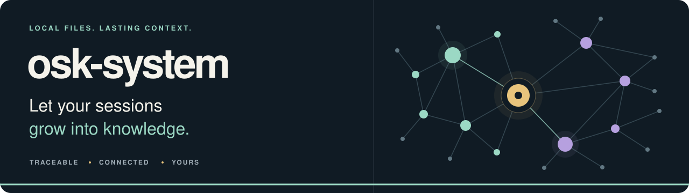
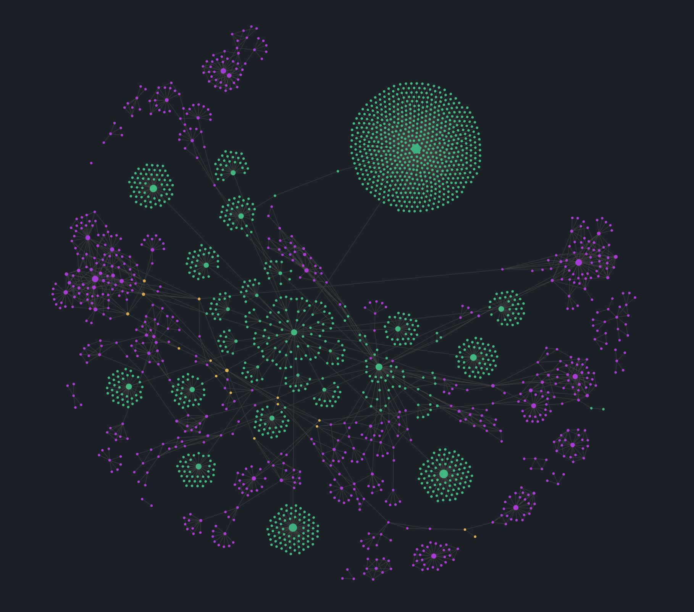
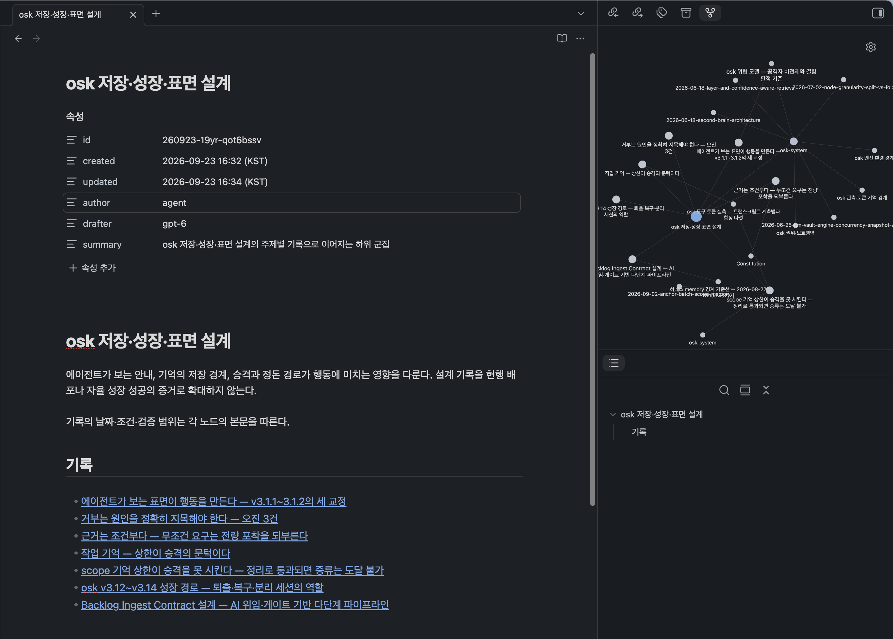

<p align="center">
  <strong>English</strong> · <a href="README.ko.md">한국어</a>
</p>

<p align="center">
  
</p>

<p align="center">
  <strong>Let your sessions grow into knowledge.</strong><br>
  A local Markdown memory where your conversations with agents grow into sourced, connected knowledge that comes back to work in the next session.
</p>

<p align="center">
  <a href="https://www.python.org/"></a>
  <a href="https://modelcontextprotocol.io/"></a>
  <a href="https://daringfireball.net/projects/markdown/"></a>
  <a href="https://obsidian.md/"></a>
  <a href="https://git-scm.com/"></a>
</p>

<p align="center">
  <a href="https://github.com/lpaiu-cs/osk-system/releases"></a>
  <a href="LICENSE"></a>
  
</p>

<p align="center">
  <a href="#quick-start">Quick start</a> ·
  <a href="docs/GETTING-STARTED.md">Getting started</a> ·
  <a href="#how-knowledge-grows">How it grows</a> ·
  <a href="docs/SETUP.md">Setup guide</a> ·
  <a href="#governance">Design &amp; governance</a>
</p>

---

> **Status: developer public beta.** The maintainer uses it daily on Windows 11.
> CI runs the test suite on Windows and Linux, and on macOS as a non-blocking
> job; daily use on macOS is not yet verified. Your vault is a Git repository:
> keep it pushed to your own private remote, or otherwise backed up, before every
> update. See the [known limitations](#known-limitations).

**Set it up with your agent.** Paste this line into Claude Code, Codex, Kiro or Antigravity:

```text
Read https://raw.githubusercontent.com/lpaiu-cs/osk-system/main/docs/INSTALL-AGENT.md and install osk-system on this device.
```

## Why it exists

It began as a one-line request: build me an LLM wiki. What came back was an
inconsistent storage scheme, blobs of unneeded information, and a structure
people could not comfortably read. Left alone, a memory like that drifts into a
plausible-sounding graph with no evidence behind it.

So osk-system started with a constitution. **What to keep as memory, how to
merge or connect it with what is already there, and when to split a topic that
has grown**: these choices are written down as rules, and the engine and the
agents grow the memory by them. The aim is not a wiki that only looks
impressive, but a working space that people can read and actually use. Not an
archive where records pile up without end, but a place where experience grows
into knowledge for the next decision.

The constitution defines the system in its first sentence:

> osk-system sustains the memory that belongs to its user, with its sources,
> context, relations and authority, and puts it back to work for later
> understanding, judgment, audit and work.

<p align="center">
  <a href="docs/assets/readme/obsidian-graph.png"></a>
  <br>
  <sub>A real vault that has grown, in Obsidian. Fresh instances start with empty knowledge Spaces. Click to view full size.</sub>
</p>

| What you need | How osk-system does it |
|---|---|
| Context that carries into the next conversation | Each session starts with the project's shared memory loaded; the agent searches and reads nodes as needed |
| Knowledge that grows instead of scattering | The same claim updates its existing node; new knowledge grows by connecting to what is already there |
| Recall you can trace | From a node to its source nodes and to specific conversation rounds |
| Memory people can read and edit | Local Markdown files, an Obsidian graph, and optional Git synchronization |

## How knowledge grows

Conversations become knowledge in a loop of five steps. On a host whose hooks
are connected (Claude Code, Codex, Kiro, Antigravity), the loop runs within your
sessions: capture is mechanical, and the agent reviews and distills when the
hooks prompt it.

1. **Capture.** The hooks record every round of the conversation in `_raw/`:
   what you and the agent said, verbatim, with tool calls and results as
   references. Raw records are evidence, not nodes.
2. **Review and distill.** At turns 9 and 15 (or, with a subscription fork, in
   the background after every 9 final answers), the agent reviews the new rounds
   together with the shared memory and distills what will last into nodes. Each
   node cites its evidence with `derived-from`, down to the conversation round.
3. **Connect and organize.** A node about the same claim is updated, not
   duplicated. New nodes stand first; a hub covering the topic links them
   afterwards and splits into branches as the topic grows. Knowledge used beyond
   one project is distilled again into Domain (by a scheduled run or on request).
4. **Recall.** When the next session starts, the project's shared memory (scope
   memory) is loaded into context, and the agent searches and reads nodes and
   their evidence.
5. **Recheck.** When evidence changes, the nodes that cite it become recheck
   candidates, and the effect spreads along the citations.

**A node is a function of its future reuse.** Keep as a node what will serve
later searches, decisions and work more than once; leave out one-off work state
and anything cheap to recompute. And **all knowledge starts at the periphery and
grows toward the center through connection**: center and periphery are one
continuous spectrum, not layers.

## Three Spaces

Each node belongs to one of three Spaces, by where it mainly applies.

| Space | What it holds |
|---|---|
| **Scope** | Memory formed within a project or activity. The raw records of its sessions (`_raw/`) are kept here too |
| **Domain** | Knowledge reused across contexts, not tied to one project |
| **Person** | The user model: records the user leaves, understanding about the user, and delegation. An agent's inference about the user is not taken as the user's fact without the user's confirmation |

The governing documents belong to no Space: the rules that define the system are
not knowledge the system organizes.

## Your memory, your authority

- **The memory belongs to you.** Agents run it under your authority. A
  delegation that outlasts a session holds only once you approve a delegation
  node stating its subject, scope and conditions; when its scope is unclear, the
  agent holds back.
- **Agents are not blocked.** They write and revise nodes directly, and every
  node records who decided its content (author) and who drafted it (drafter).
  MCP writes pass through node-contract validation.
- **Trust comes from sources, relations and history, not from an approval
  stamp.** You can trust what you can trace.
- **Protected regions make changes reviewable and reversible.** In the parts you
  choose (the governing documents and delegation are always protected), edits
  still take effect at once. The engine keeps the state you last approved (the
  **approved snapshot**), and the difference remains as a **changeset** for you
  to approve or revert. Protecting, unprotecting, approving and reverting are
  yours alone. These records live in ledgers outside the nodes, and records from
  several devices are judged by causality (a DAG), not by timestamps.
- **The system does not claim to enforce what it cannot.** Protected regions
  undo honest mistakes; they are not a security boundary against someone with
  arbitrary write access to the vault. Authorization checks hold back when they
  cannot be evaluated mechanically. See the
  [engine's limitations](_governance/_engine/README.md#알려진-한계).

## The stack

A Python engine exposes MCP tools over stdio, stores knowledge in Markdown,
and retrieves it with BM25. Obsidian is an optional way to explore the graph;
Git synchronization is opt-in. Capture and periodic-review adapters currently
support **Codex, Claude Code, Kiro and Antigravity**. See the
[runtime dependencies](_governance/_engine/requirements.txt).

## Quick start

**Let your agent install it.** Paste this line into Claude Code, Codex, Kiro or Antigravity:

```text
Read https://raw.githubusercontent.com/lpaiu-cs/osk-system/main/docs/INSTALL-AGENT.md and install osk-system on this device.
```

The agent asks where to create the vault and which optional features you want,
clones the newest release and runs the [setup tool](docs/SETUP.md#설치-도구-setup).
The setup tool shows you its plan and applies it only after you confirm.

**New to osk-system?** Follow the [Getting started](docs/GETTING-STARTED.md)
tutorial. It goes from an empty folder to your agent's first saved memory, on
macOS, Linux and Windows, with a check after every step.

**Updating a v3 vault?** Read [Upgrading](docs/UPGRADING.md) before you apply
v4: it lists the placements v4 no longer reads and how to move them.

**To install by hand**, you need Python 3.11 or newer and Git. Start from a
release tag rather than `main` (newer tags are on the
[releases page](https://github.com/lpaiu-cs/osk-system/releases)):

```bash
git clone --branch v4.1.2 https://github.com/lpaiu-cs/osk-system.git my-osk-vault
cd my-osk-vault
git switch -c main
python _governance/_engine/scripts/setup.py --interactive
```

Use `python3` if `python` is missing, or `py -3.12` on Windows. The setup tool
creates `.venv`, installs the dependencies and records the release baseline, so
that later updates can tell release files from your own edits. It then connects
the hosts it finds on this device (Claude Code, Codex, Kiro and Antigravity) by
registering the MCP server and the three hooks. It shows the plan and asks
before it writes. Afterwards, `python _governance/_engine/scripts/setup.py doctor`
checks each connection.
[Getting started](docs/GETTING-STARTED.md#step-2-install-the-engine-and-record-the-release-baseline)
shows the same steps one command at a time.

- **Another MCP client:** copy [.mcp.json.example](.mcp.json.example) and replace
  `<REPO>` with the vault's absolute path (on Windows the interpreter is
  `.venv/Scripts/python.exe`). The [setup guide](docs/SETUP.md) covers
  client-specific registration, hooks and Windows commands. The detailed
  operations and governance documents are currently in Korean.
- **Obsidian:** open `my-osk-vault` as a vault.
- **Sync:** before enabling synchronization, point your instance at **your own
  private remote**. Do not push personal notes, ledgers, or transcripts to the
  public upstream repository.

> The MCP server alone does not turn on automatic capture or periodic review;
> the hooks do. The setup tool registers both. If you connect a client by hand,
> add its hooks too. See [harness coverage](#harness-coverage).

## Usage

<p align="center">
  <a href="docs/assets/readme/obsidian-note-local-graph.png"></a>
  <br>
  <sub>Read a knowledge note alongside its local graph. Original capture from a Korean-language vault; click to view full size.</sub>
</p>

**Recall → inspect the evidence → update the memory.** With the hooks connected,
capture and recall happen on their own. When you need to, ask your agent:

```text
Find prior decisions about this project. Read the source notes before drawing conclusions.

Record the verified outcome of this task in the project's memory and link its evidence.
```

In Obsidian, explore connections between clusters in the global graph, then open
a note beside its local graph to read the surrounding context. **The graph shows
connections, not approval status.** Use the engine's `status` command to check
protected regions; review their changesets in the human approval workflow.

```bash
PYTHONPATH=_governance/_engine .venv/bin/python -m osk.cli status
PYTHONPATH=_governance/_engine .venv/bin/python -m osk.cli search "project decisions"
```

## Harness coverage

Automatic capture and periodic integration currently have adapters for **Codex,
Claude Code, Kiro and Antigravity**. Subscription-backed forks are for Codex and
Claude Code only; Kiro and Antigravity always integrate in-session at turns 9 and
15. Being able to call MCP tools from
another client does not mean session hooks or autonomous knowledge growth are
connected.

| Runtime conditions | Conversation review path |
|---|---|
| Supported hooks and subscription CLI; authentication and version checks pass | A background fork using the same harness and model after every **9 successful final-answer Stop events** |
| CLI unavailable or unconfigured; login, subscription, version, or permission checks fail; Codex task directory is neither a Git worktree nor a trusted Codex project; the last two fork reviews did not finish (the fork is tried again a day later) | A **review warning** and in-session integration at **input turns 9 and 15** (UserPromptSubmit; PreInvocation on Antigravity) |
| Harness without an adapter | No guarantee of automatic capture, counting, or fallback; integration and verification are still required |

Input counts continue in background mode. Switching paths does not reset pending
reviews or either counter; a pending review already past turn 9 is surfaced
immediately. When login recovers, or a day after two fork reviews in a row failed
to finish, review returns to Stop-based execution.
Failed subscription checks do not silently fall back to paid API calls.

<details>
<summary>Cache evidence, review boundaries, and future harness support</summary>

Cache reuse is a separate verification target. A fork immediately after a final
answer in the Codex app, using the same Sol model, achieved a **98.74% cache hit
rate** in one measured experiment. The default CLI configuration on the same
source session achieved 0%, so app-originated forks preserve app tool definitions
automatically. This is not a universal guarantee across versions or models.
Implementation, installation, cache hits, and actual node growth are different
claims. See [setup and fallback behavior](docs/SETUP.md) and
[experimental evidence and limitations](docs/response-growth.md).

Updates belong together when they concern the same **claim and applicability
conditions**, not simply the next task in a project. Organization review records
the ranges actually read; reading only part of a cluster does not complete the
whole cluster's review. See [bounded review and safe splitting](docs/hub-growth-review.md).

Each additional harness needs verification of conversation and completion IDs,
transcript boundaries, hook events, subscription authentication, one-shot
execution, and failure fallbacks.

</details>

## Known limitations

- **Folders outside Git share by name.** The session key is the repository
  folder's name (worktrees fold into their main repository; submodules and bare
  repositories use their own name). Since v4 an unrelated Git repository whose
  root commits differ from the key's owner gets `<name>-<first 8 hex of its root>`
  instead, so it neither receives nor writes the other's Scope memory. Folders
  outside Git, repositories without commits and shallow clones have no identity
  and still share by folder name.
- **Background reviews inherit the source session's permissions.** A
  subscription fork review runs unattended with the reviewed session's own
  Claude Code permission mode, or Codex approval and sandbox policy. This is by
  design. The fork re-reads that conversation, including any untrusted text it
  contains.
- **Node bodies are not secret-filtered.** This is by design. The secret filter
  covers raw transcripts, Scope memory, and writes distilled from raw records.
  Keep secrets out of notes: they are committed and synchronized.
- **Protected regions are not a security boundary.** They help prevent and
  recover from honest mistakes; see [Your memory, your authority](#your-memory-your-authority).
- **Antigravity on Windows needs plain paths.** It runs hooks through `cmd`,
  which cannot read a quoted path. The vault and Python paths must not contain
  spaces or cmd special characters (`& | < > ^ % ! ( ) , ; =`). The setup tool
  refuses such a path before writing anything; `--harness` connects the other
  hosts.
- **Autonomous growth is experimental.** Its effect is still being measured
  ([issue #20](https://github.com/lpaiu-cs/osk-system/issues/20)).
- **The governing documents are in Korean only.**

## Governance

The rules defining the system live in `_governance/`, outside the knowledge
Spaces: the rules that organize knowledge are not themselves knowledge being
organized by the system.

| Document | Responsibility |
|---|---|
| [Constitution](_governance/Constitution.md) | Spaces, nodes, reference topology, delegation, protected regions, cases, and amendments |
| [Bylaws](_governance/Bylaws.md) | Operating rules for node and raw-record contracts, clusters, pins, delegation, and protected regions |
| [Mechanism](_governance/Mechanism.md) | Physical layout, identifiers, timestamps, ledgers, MCP contracts, link syntax, and secret filtering |
| [Workbench contract](_governance/Workbench-Contract.md) | The special status and organization rules of the operational Workbench scope |

Read **Constitution → Bylaws → Mechanism**. Mechanism §3 (approval ledger) and
§6-2 (external surface) specify the protected regions and MCP writes described above. These documents
are currently in Korean; this README is an introduction, not a replacement for
the governing text.

[docs/FORMAT.md](docs/FORMAT.md) is an English, non-normative commentary on the
on-disk format that the Mechanism defines.

Ratification is the user's explicit act in the canonical repository, fixed by
the release attestation (`release.json`, containing file content hashes).
Release declaration can run noninteractively without a separate version approval.
The first update-apply attempt shows its changeset and the required harness
restart, then stops for explicit user confirmation. A matching retry applies it
and records acceptance of the protected governance region in the same transaction.
On an install where the governance region was never protected, the same confirmed
retry protects it, but only when its files match the release attestation exactly.
A newer release is announced once a day per device, at session start or in
`overview`; nothing is applied until you ask for the update.
See [installation and operations](docs/SETUP.md).

## What's in this repository

The engine, governing documents, and operating guides. **Not** your knowledge
corpus, approval ledgers, other operational ledgers, or session transcripts.

The empty `00_Scope/`, `00_Domain/`, and `00_Person/` directories are starting points
for your own instance. Personal data belongs in that instance, not in this public
repository.

The [v4.2 growth milestones](docs/v4.2-milestones.md) (Korean) describe the development
sequence and acceptance criteria.

## License

[MIT](LICENSE)
